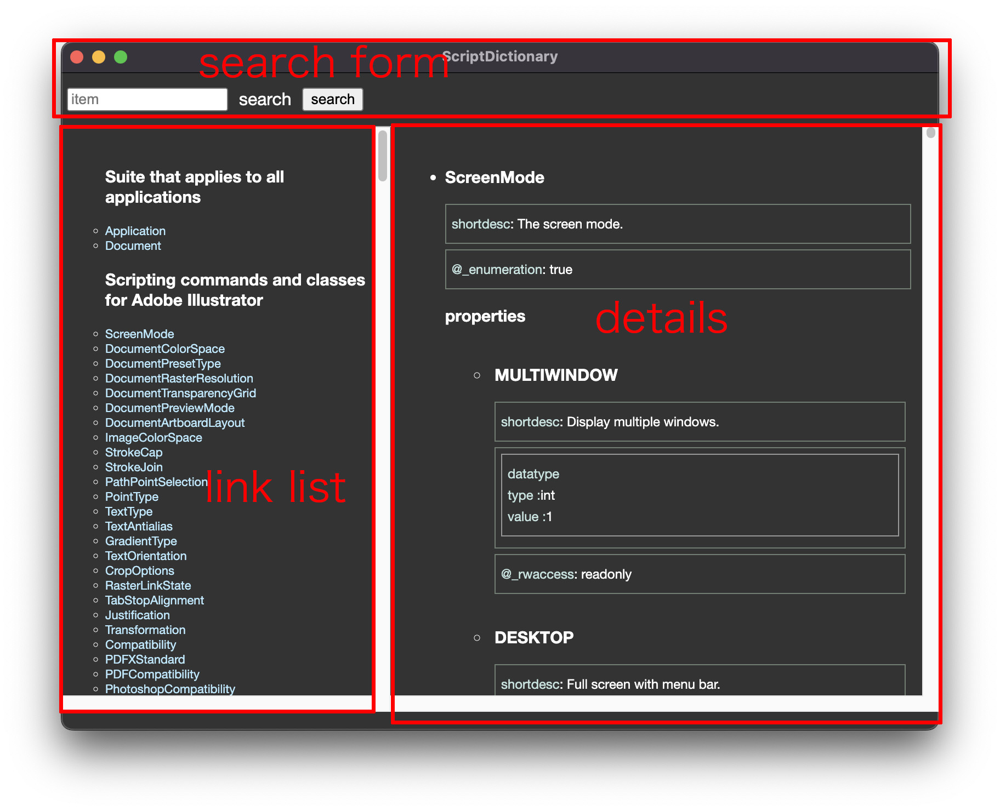

# ScriptDictionary

this app for viewing Adobe ExtendScript XML as a omv.xml.

ExtendToolkit loads XML data which is written Document Object Model and listing on UI.
but as you know the app isn't supported any more even on Mac OS, it's impossible to open.
but still omv.xml file exists.
in this lists can help to develop and understand ExtendScript Object model.
they explain many object details.
so I decided to develop this.

*Japanese explanation*  
[here](https://kawano-shuji.com/justdiary/2023/12/19/electron-script-dictionary/) you can see

## where can I find omv.xml?

on Mac OS you can see here.
"/Library/Application Support/Adobe/Scripting Dictionaries CC"

on Win OS here.
"C:\Program Files (x86)\Common Files\Adobe\Scripting Dictionaries CC"

but some omv.xml file can be saved other directory.
like Premiere's xml saved here on Win.
"C:\Users\username\AppData\Roaming\Adobe\ExtendScript Toolkit\4.0"

even though, I couldn't find some application's XML like InDesign, AfterEffects.

## what are written

on XML you could see some Object model like this.
```
<property name="pixelAspectRatio">
  <shortdesc>The (custom) pixel aspect ratio of the document. Range: 0.100 to 10.000.</shortdesc>
  <datatype>
    <type>number</type>
  </datatype>
</property>
```
this indicates pixelAspectRatio class and it has number type of value.
but you may think this bit hard to read on text editor.

### parsing XML and displaying on UI

this app loads XML and displays on UI.
after opning it, you'll see dialog and choose XML.
then this app loads XML and transfer to list on UI.



on left side, there is a link list.
each class name navigates you to detail on right side.

on right side, details of class.

and on top side, there is a search form.
you can search word on this UI.

### what indiates on each list

on XML, many type of descriptions and properties.
but I don't know exactly what is described.
because just I developed parsing app, but I explain some of keys.

- name  
name of class

- dataType  
type of data. like number or string

- rwaccess  
read only or not. I saw only readonly parameter.

- enumeration  
can be enumerated object or not.

- optional  
I supporse this indicates that can be emitted or not.

## Note
I thoroughly inspected construction of XML but this app can miss some keys in XML.

### Tested applications

I tested application's XMLs below the list.

- Photoshop
- Illustrator
- Premiere
- JavaScript
- ScriptUI

but I couldn't find AfterEffects and InDesign XMLs.
now I try to find them.

## How to use it?

copy this code using clone.

```
git clone https://github.com/tokyosheep/ScriptDictionary.git
```

then, install npm modules.

```
npm install
```

and build the code.

```
npm run build
```

finally start the app.
```
npm start
```

or even you can package it.
```
npm run make
```

## donation

I would appreciate if you donated.
[donation](https://www.buymeacoffee.com/tokyosheepp);